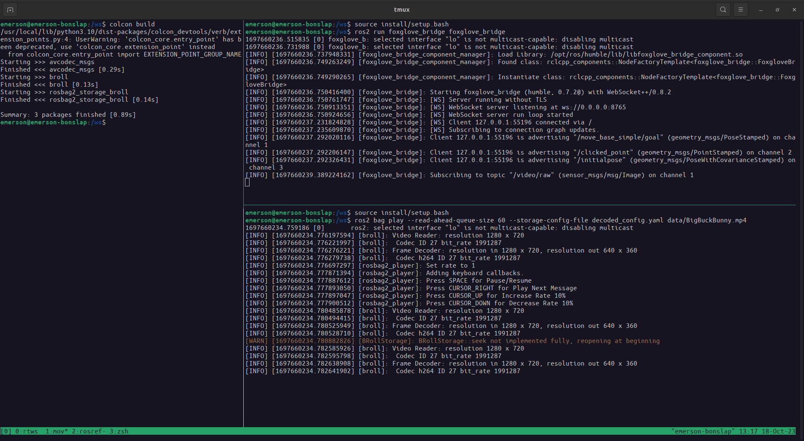
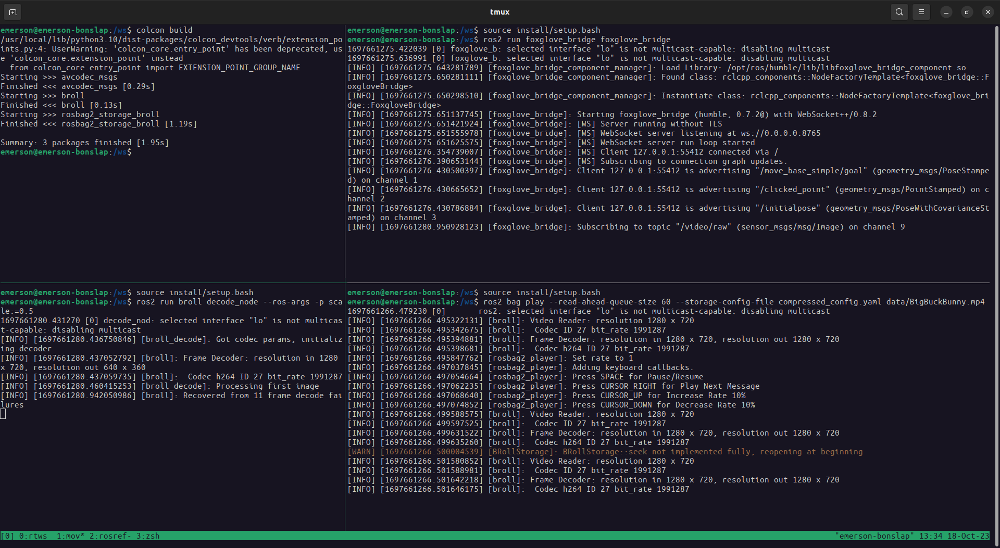
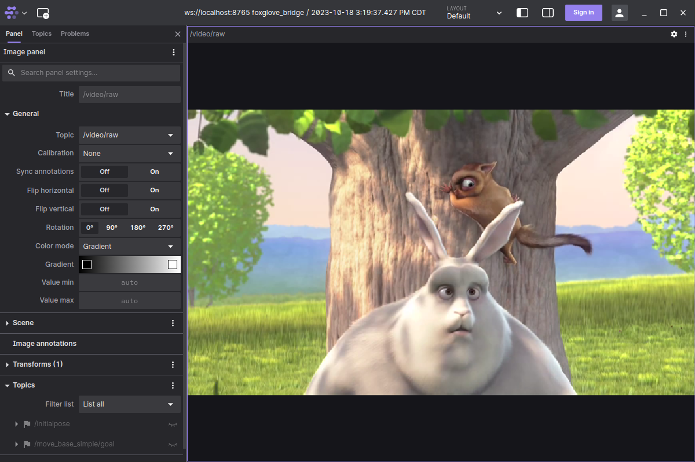

# B-Roll: Video data in rosbag2

This repository contains plugins and libraries for interacting effectively with video data using rosbag2.

NOTE: This project is in an early stage and is incomplete - please forgive any issues, pull requests welcome!

Contains the following packages, see their respective `README.md` for more information:
* [`broll`](./broll/) The main `broll` utility library
* [`rosbag2_storage_broll`](./rosbag2_storage_broll/) A Rosbag2 storage implementation that can read encoded video frames from video files, and optionally decode them into raw images


## Sample workflows

### Getting started

1. Go get any old mp4 file (h264 and h265/hevc encoding only supported so far). A recommendation: download Big Buck Bunny! [from blender](https://download.blender.org/peach/bigbuckbunny_movies/) or [here's one mirror](https://test-videos.co.uk/bigbuckbunny/mp4-h264)
1. `colcon build` the packages in this repository after `rosdep install`ing their dependencies

### For all demos

1. In one shell, run
```
ros2 run foxglove_bridge foxglove_bridge
```
2. Open Foxglove Studio, either native or in browser
    * Open Connection... to `ws://localhost:8765`
    * Create an Image panel and point it to topic `video/raw`


### Publishing decoded video:

1. Create a file `decoded_config.yaml` with the following contents:
```
# decoded_config.yaml
pub_compressed: false
pub_decoded: true
decoded_scale: 0.5
```

2. In a shell, run
```
ros2 bag play --read-ahead-queue-size 60 --storage-config-file config.yaml path/to/my/movie.mp4`
```

3. Enjoy watching your movie in Foxglove!




### Publishing compressed/encoded video

1. Create a file `compressed_config.yaml` with contents:
```
# compressed_config.yaml
pub_compressed: true
pub_decoded: false
```

2. In a shell, run
```
ros2 bag pay --read-ahead-queue-size 60 --storage-config-file config.yaml path/to/my/movie.mp4
```

3. In a separate shell, run
```
ros2 run broll decode_node
```

4. Enjoy watching your movie in Foxglove!





